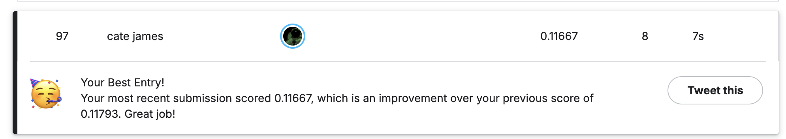
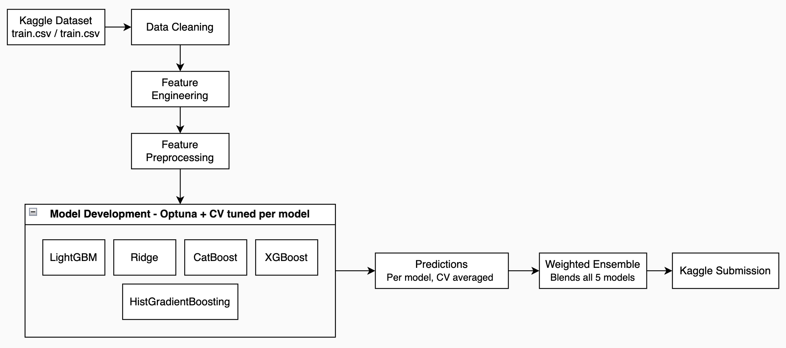

# Kaggle House Prices - Advanced Regression Techniques

An end-to-end machine learning pipeline for Kaggle's [House Prices: Advanced Regression Techniques](https://www.kaggle.com/c/house-prices-advanced-regression-techniques) competition, combining careful feature engineering, per-model hyperparameter optimisation and weighted ensemble learning.

**Achievement: Top 100 worldwide Kaggle ranking (rank 97 at the time of writing), with a leaderboard RMSE of 0.11667.**



> **Note:** the final submission pipeline that produced the top-100 result is kept private. This repository documents the approach and provides an example implementation.

## Project Overview

The task is to predict the final sale price of residential homes in Ames, Iowa, using 79 explanatory features describing almost every aspect of a property, including:

- Lot and land characteristics (area, shape, frontage, slope)
- Location and zoning (neighbourhood, proximity to roads and amenities)
- Building type, style, quality and condition
- Interior areas (living space, basement, bathrooms, bedrooms)
- Garage, porch and outdoor features
- Year built, remodelling history and sale details

## Evaluation Metric

Submissions are scored on the root mean squared error between the logarithm of the predicted price and the logarithm of the observed sale price:

$$
\text{RMSE} = \sqrt{\frac{1}{n}\sum_{i=1}^{n}\left(\log(\hat{y}_i + 1) - \log(y_i + 1)\right)^2}
$$

Working in log space makes errors relative rather than absolute, so mispricing a cheap house and an expensive house by the same percentage is penalised equally.

## Pipeline Architecture



The pipeline applies identical preprocessing to the training and test sets, guaranteeing that the models always see consistently transformed features. Each model is then tuned independently with Optuna, using k-fold cross-validation to score every trial, before the tuned models are combined into a weighted ensemble.

## Feature Engineering

Feature engineering choices are driven by the semantics of the data rather than blanket transformations:

- **Ordinal encoding for quality features** — quality and condition ratings (e.g. `Ex`, `Gd`, `TA`, `Fa`, `Po`) carry a natural order, so they are mapped to ordinal scales instead of being one-hot encoded.
- **Semantic missing-value handling** — missing values are filled according to what they actually mean: a missing basement feature indicates the house has no basement, not that the data is unknown.
- **Derived area and age features** — total square footage, combined bathroom counts, house age and time since remodelling condense related raw columns into stronger signals.
- **Aggregated quality indicators** — individual quality ratings are combined into overall quality scores that summarise the condition of the property.
- **Selective interaction features** — a small number of interaction terms (e.g. quality × area) are added only where they demonstrably improve cross-validation performance.

## Models Used

| Model | Purpose |
| --- | --- |
| LightGBM | Fast gradient boosting, strong on tabular data with many features |
| XGBoost | Regularised gradient boosting, robust to overfitting |
| CatBoost | Gradient boosting with native handling of categorical features |
| HistGradientBoosting | scikit-learn's histogram-based booster, adds diversity to the ensemble |
| Ridge Regression | Penalised linear baseline that captures global linear structure |

**Why an ensemble?** Each model makes different kinds of errors: the boosted trees capture non-linear interactions in different ways, while Ridge contributes a stable linear view of the data. Averaging their predictions cancels out uncorrelated errors and produces a lower overall RMSE than any single model achieves alone.

Ensemble weights are learned from out-of-fold (OOF) predictions: each model predicts the held-out folds during cross-validation, and the blend weights are optimised against these OOF predictions so that the weighting is never fitted on data a model has already seen.

## Optimisation & Engineering

- **Cross-validation strategy** — k-fold cross-validation is used throughout, both for hyperparameter tuning and for ensemble weighting, giving reliable estimates of generalisation performance.
- **Model-specific optimisation** — every model gets its own Optuna study with a search space tailored to its hyperparameters, rather than sharing a generic configuration.
- **Reusable preprocessing pipeline** — preprocessing is packaged as a single pipeline applied identically to training and test data, eliminating train/test skew.
- **Reproducibility** — fixed random seeds and persisted artefacts (via Joblib) make every run repeatable.

## Technologies

- Python
- pandas
- NumPy
- scikit-learn
- LightGBM
- XGBoost
- CatBoost
- Optuna
- Joblib

## Installation + Setup Demo

```bash
pip install -r requirements-example.txt
python example_model.py
```

## License

The example implementation in this repository is released under the MIT License. The final competition pipeline is not included in this repository.
